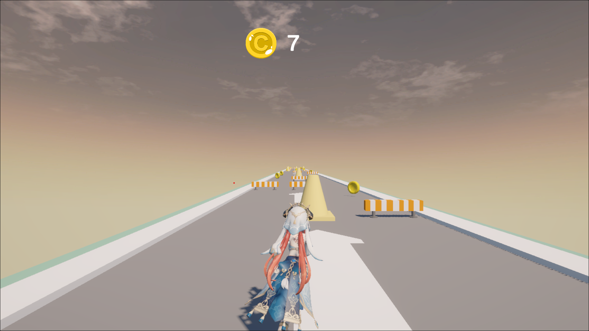

# 🌸 Runner Endless - Nilou Edition 🌸

Một game **Endless Runner** đơn giản được làm bằng **Unity (WebGL build)**, nhân vật chính là **Nilou** (Genshin Impact fanmade).  
Người chơi có thể chạy thử game **trực tiếp trên trình duyệt** qua GitHub Pages mà không cần tải về.  

👉 [Chơi ngay tại đây](https://interface-daodung.github.io/RunnerEndless/)  

---

## 🎮 Gameplay
- Người chơi điều khiển Nilou chạy không ngừng về phía trước.
- Thu thập **xu vàng** để tăng điểm.
- Tránh các chướng ngại vật, nếu va chạm → game over.
- Tốc độ sẽ tăng dần theo thời gian → thử thách ngày càng khó.

---

## 🕹️ Điều khiển
- **Phím mũi tên trái/phải**: Di chuyển sang 2 bên.
- **Phím Space**: Nhảy qua chướng ngại vật.
- **Esc**: Tạm dừng game.

---

## ✨ Tính năng
- Nhân vật chính: **Nilou (fanmade từ Genshin Impact)**.
- Endless gameplay – không có hồi kết.
- Hệ thống điểm số: số xu + khoảng cách chạy.
- Âm thanh và hiệu ứng cơ bản.
- Build sẵn WebGL, chạy trực tiếp trên GitHub Pages.

---

## 📷 Hình ảnh minh họa
*(Thêm ảnh screenshot của game tại thư mục `Screenshots/` trong repo, ví dụ:)*

```markdown

